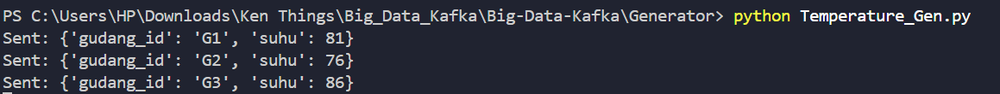
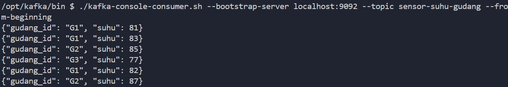
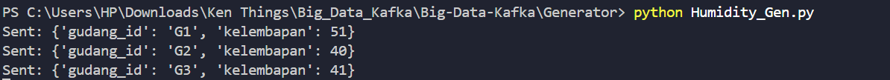

# Big-Data-Kafka

**Nama:** Michael Kenneth Salim  
**NRP:** 5027231008

---

# 📋 Tugas: Monitoring Gudang dengan Kafka dan PySpark

## 1. Membuat Topik Kafka
Membuat dua topik di Apache Kafka:
- `sensor-suhu-gudang`
- `sensor-kelembaban-gudang`


> Topik ini akan digunakan untuk menerima data dari masing-masing sensor secara real-time.

---

## 2. Mengsimulasikan Data Sensor (Kafka Producer)

Membuat dua Kafka producer terpisah:

### a. Producer Suhu
- Kirim data setiap detik
- Format data:
```json
{"gudang_id": "G1", "suhu": 82}
````






### b. Producer Kelembaban

* Kirim data setiap detik
* Format data:

```json
{"gudang_id": "G1", "kelembaban": 75}
```





> Gunakan minimal 3 gudang: `G1`, `G2`, `G3`.

---

## 3. Konsumsi dan Olah Data dengan PySpark

### a. Buat PySpark Consumer

* Konsumsi data dari kedua topik Kafka

### b. Lakukan Filtering

* Suhu > 80°C → tampilkan sebagai **peringatan suhu tinggi**
* Kelembaban > 70% → tampilkan sebagai **peringatan kelembaban tinggi**

#### Contoh Output:

```
[Peringatan Suhu Tinggi]
Gudang G2: Suhu 85°C

[Peringatan Kelembaban Tinggi]
Gudang G3: Kelembaban 74%
```


---

## 4. Gabungkan Stream dari Dua Sensor

### a. Join Stream

* Lakukan join antar dua stream berdasarkan `gudang_id` dan window waktu (misalnya 10 detik) untuk mendeteksi kondisi **bahaya ganda**.

### b. Buat Peringatan Gabungan

Jika ditemukan:

* **Suhu > 80°C** dan **Kelembaban > 70%** pada gudang yang sama
  → tampilkan **peringatan kritis**.

#### ✅ Contoh Output Gabungan:

```
[PERINGATAN KRITIS]
Gudang G1:
- Suhu: 84°C
- Kelembaban: 73%
- Status: Bahaya tinggi! Barang berisiko rusak

Gudang G2:
- Suhu: 78°C
- Kelembaban: 68%
- Status: Aman

Gudang G3:
- Suhu: 85°C
- Kelembaban: 65%
- Status: Suhu tinggi, kelembaban normal

Gudang G4:
- Suhu: 79°C
- Kelembaban: 75%
- Status: Kelembaban tinggi, suhu aman
```


